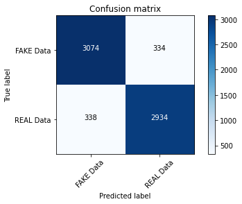

# Fake news classifier

Download dataset from 

## Machine learning pipeline is created using SKLearn 

#### Case 1: CountVectorizer & Naive Bayes. Hyperparameter tunes using GridSearchCV.

Accuracy - 89%
