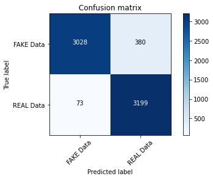
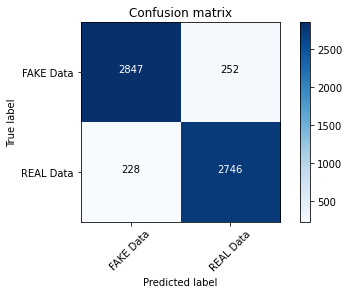
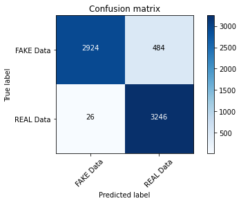

# Fake news classifier

Download dataset from [Kaggle-Fake News Classifier](https://www.kaggle.com/c/fake-news)

## Machine learning pipeline for NLP Problems is created using Sklearn 

#### Solution 1: CountVectorizer & Naive Bayes. Hyperparameter tuned using GridSearchCV.

Accuracy - 89%

#### Solution 2: CountVectorizer & PassiveAggressiveClassifier. Hyperparameter tuned using GridSearchCV.

Accuracy - 93%

#### Solution 3: WordEmbedding & LSTM

One lstm layer with 100 neurons
Epoch 10/10
222/222 [==============================] - 4s 19ms/step - loss: 2.6340e-04 - accuracy: 0.9999 - val_loss: 0.5344 - val_accuracy: 0.9206
Accuracy: 0.9206323069323235

Two lstm layers with 50 neurons W/o Dropout
Epoch 10/10
222/222 [==============================] - 5s 20ms/step - loss: 0.0039 - accuracy: 0.9989 - val_loss: 0.4144 - val_accuracy: 0.9216
Accuracy: 0.9216202865140787
Over-fitting

Two lstm layers with 50 neurons With Dropout
Accuracy: 0.921290959986827
Performs better, but in this dataset, there's not much significant difference is visible.

Updated - One lstm layer with 10 neurons
Epoch 1/10
222/222 [==============================] - 11s 50ms/step - loss: 0.5251 - accuracy: 0.7650 - val_loss: 0.1971 - val_accuracy: 0.9290
Epoch 2/10
222/222 [==============================] - 11s 50ms/step - loss: 0.1256 - accuracy: 0.9577 - val_loss: 0.1786 - val_accuracy: 0.9312
Epoch 3/10
222/222 [==============================] - 11s 51ms/step - loss: 0.0613 - accuracy: 0.9828 - val_loss: 0.1978 - val_accuracy: 0.9251

So it starts to overfit after 2 epochs only. So I introduced early stopping here.
So, then it stopped at epoch 3, with following metrics:
Epoch 3/10
222/222 [==============================] - 11s 50ms/step - loss: 0.0658 - accuracy: 0.9804 - val_loss: 0.1988 - val_accuracy: 0.9210
Accuracy: 0.9209616334595752

#### Solution 4: CountVectorizer & LogisticRegression. Hyperparameter tuned using GridSearchCV.

Accuracy: 0.9236526946107785
